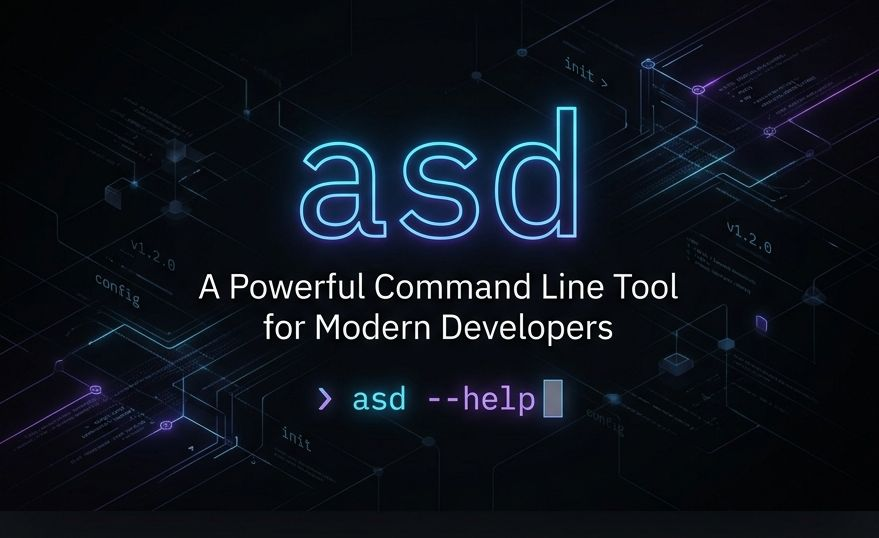

  

  <h1>asd</h1>
  
  
<b>A smart universal file viewer for the modern terminal.</b>

  
  
  
  
  

 

`asd` replaces traditional tools like `cat` with smart, type-aware file rendering. By automatically detecting file types via magic bytes (and falling back to extensions), `asd` formats and renders them with beautiful syntax highlighting, layout tables, tree views, and media metadata. 

When you output more text than your terminal can fit, `asd` instantly buffers into an interactive pager. If you pipe the output to another tool, it smartly defaults back to raw bytes (behaving exactly like `cat`).

  

## 🚀 Features

- **Code & Text**: Beautiful syntax highlighting using [Chroma](https://github.com/alecthomas/chroma), with line numbers and theme support.
- **Structured Data**: JSON, YAML, TOML formatting and valid syntax checking.
- **Data Tables**: CSV and TSV formatted into beautiful, auto-sizing terminal tables via [Lipgloss](https://github.com/charmbracelet/lipgloss).
- **Markdown**: Fully styled Markdown rendering using [Glamour](https://github.com/charmbracelet/glamour).
- **Archives**: Explores zip, tar, tar.gz, 7z, and rar as interactive directory trees showing uncompressed stats.
- **Office Docs & PDF**: Automatically extracts and parses text from DOCX, XLSX, PPTX, ODT, and PDFs without you needing to extract them manually!
- **Media**: Peeks into Audio and Video files to reveal track metadata, codecs, and durations. **Images** are rendered natively in your terminal! Enjoy pixel-perfect inline images on modern terminals like iTerm2, WezTerm, and Ghostty, or elegantly scaled true-color ANSI blocks on all standard terminals.
- **Security**: Displays X.509 PEM/CRT properties and SSH Key parameters effortlessly.
- **Git Integration**: Built-in gutter diffs show added, modified, and removed lines instantly!
- **Tail/Follow Mode**: Use `asd -F <file>` to tail streaming logs with full real-time syntax highlighting.
- **Log Formatting**: Intelligent, on-the-fly parsing and beautiful colorization of log files (`.log`, `/var/log/*`, etc) formatting timestamps and log levels neatly!
- **Side-by-Side Diffing**: Use `asd <file1> <file2> --diff` for a beautiful side-by-side terminal diff view.
- **Certificate Parsing**: Peek into `.pem`, `.crt`, and `.der` files to automatically parse X.509 certificates and read their metadata (Issuer, Subject, Validity) just like `openssl x509 -text`!
- **UI Customization**: Use `--clean` to hide headers and line numbers for clean copying, or `--no-pager` to disable auto-paging.
- **Smart Piped Input**: Pass `curl` payloads directly into `asd`; it automatically detects the content type and highlights the piped output!
- **Directories**: View styled `ls -la` directory trees and resolve symlinks.
- **Hex Dump**: Safely view unknown binaries with built-in hex-dumping.

## 📦 Installation

### Using Homebrew (macOS/Linux)
\`\`\`bash
brew tap orchestrator-dev/asd
brew install asd
\`\`\`

### Using Go
Ensure you have Go `1.23` or higher.
\`\`\`bash
go install github.com/orchestrator-dev/asd@latest
\`\`\`

### Download Pre-built Binaries
Head over to the [Releases](https://github.com/orchestrator-dev/asd/releases) page to download pre-built binaries for your OS and architecture (Windows, macOS, Linux).

*Note: The GitHub Actions workflows are actively compiling `v0.8.3`, so the binaries will appear on the release page momentarily!*

## 📖 Usage

Using `asd` is as simple as using `cat`.

\`\`\`bash
asd [flags] [file...]
\`\`\`

**Examples:**
\`\`\`bash
# Read a simple text or code file (syntax highlighted)
asd main.go

# Read multiple files at once
asd config.yaml payload.json

# Read a compressed archive without unzipping
asd data.zip

# Pipe from another program (reads stdin)
echo "{\"test\": 123}" | asd
\`\`\`

### Flags

| Flag | Long Flag | Description |
|------|-----------|-------------|
| `-f` | `--flat`  | Bypass all smart rendering and act identically to `cat`. |
| `-n` | `--lines` | Show line numbers alongside text and source code. |
| `-p` | `--plain` | Disable all color and styling (good for older terminals). |
| | `--theme` | Specify a chroma highlight theme (default is `auto`). |
| `-h` | `--help`  | Print usage and help menus. |
| | `--version` | Print the current version and exit. |

## ⚙️ Configuration

You can customize `asd` permanently using a global config file located at `~/.config/asd/config.toml`:

\`\`\`toml
# Set your preferred Chroma theme for syntax highlighting
theme = "dracula"
\`\`\`

## 🛠 Compilation and Development

\`\`\`bash
git clone https://github.com/vsmanu/asd.git
cd asd
go mod download
make build
\`\`\`

You can run the tests using:
\`\`\`bash
make test
\`\`\`

## 📄 License

This project is licensed under the MIT License.